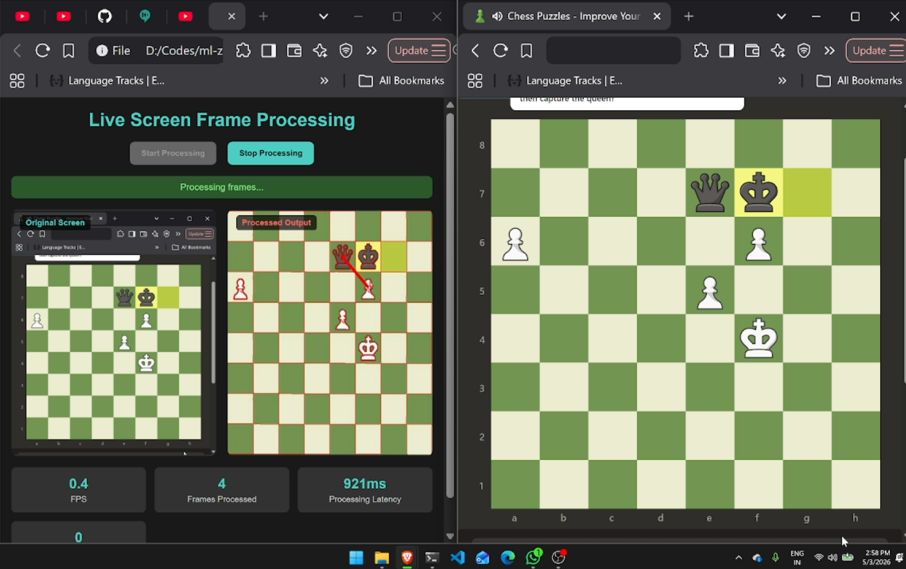
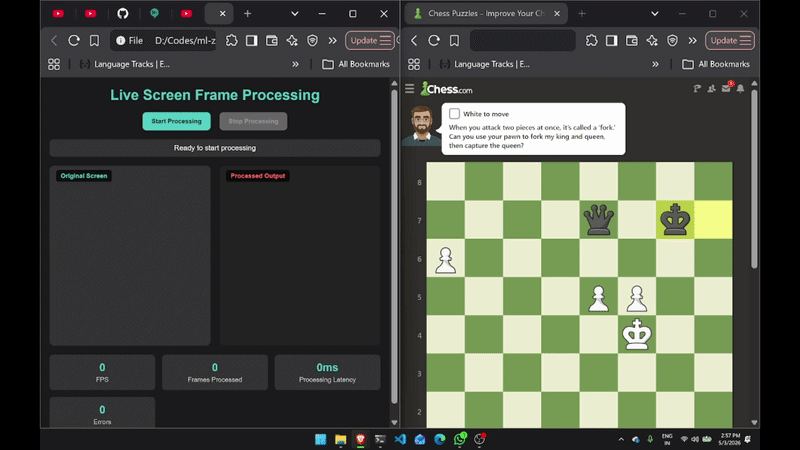

# ♟️ Chess Board Next Move Predictor

<div align="center">
  
</div>

A computer vision and machine learning application that detects chess board positions from images, classifies chess pieces using deep learning, and predicts the best next move to solve chess puzzles.


## 🎯 Features

- **Chess Board Detection**: Automatically detects and extracts chess boards from images
- **Piece Classification**: ML-based chess piece recognition (trained deep learning model)
- **Puzzle Solving**: Intelligent chess algorithm to find the best next move
- **Web Interface**: FastAPI-based web application for easy interaction
- **Real-time Processing**: Process chess board images and get solutions instantly

## 🎬 Demo

### Solving Chess Puzzle Animation
<div align="center">
  
</div>


## 🏗️ Project Structure

```
.
├── application/
│   ├── find_ip.py
│   ├── web app/
│   │   ├── main.py                 # FastAPI application
│   │   ├── templates/
│   │   │   └── index.html          # Web UI
│   │   ├── util_functions/
│   │   │   ├── chess_board_detection.py
│   │   │   ├── chess_peice_classifier.py
│   │   │   ├── chess_solver.py
│   │   │   ├── disect_chessboard.py
│   │   │   └── image_processing.py
│   │   └── testing.ipynb
│   └── __init__.py
├── chess_solving algorithm/
│   └── chess_algorithm.py
├── machine learning/
│   ├── chess_piece_classification_model.h5
│   ├── chess_piece_classifier.h5
│   ├── model.ipynb
│   └── data_agumentation.ipynb
├── data/
│   ├── board pics/
│   └── pieces/                     # Piece images for training
│       ├── bishop/
│       ├── king/
│       ├── knight/
│       ├── pawn/
│       ├── queen/
│       └── rook/
├── Result/                         # Solution results
├── code.ipynb
└── README.md
```

## 🚀 Quick Start

### Prerequisites
- Python 3.8+
- TensorFlow / Keras
- OpenCV
- FastAPI
- NumPy

### Installation

1. Clone the repository:
```bash
git clone https://github.com/yourusername/chess-board-next-move-predictor.git
cd chess-board-next-move-predictor
```

2. Install dependencies:
```bash
pip install -r requirements.txt
```

3. Navigate to the web app directory:
```bash
cd application/web\ app
```

4. Run the application:
```bash
uvicorn main:app --reload
```

The web interface will be available at `http://localhost:8000/template`

## 🧠 How It Works

### 1. **Chess Board Detection**
- Utilizes image processing techniques to locate chess boards in photos
- Applies perspective transformation to get a top-down view
- Extracts individual squares for analysis

### 2. **Piece Classification**
- Deep learning model trained on labeled chess piece images
- Classifies each square as: Pawn, Knight, Bishop, Rook, Queen, King, or Empty
- Supports both white and black pieces

### 3. **Puzzle Solving**
- Implements chess algorithms to analyze the board position
- Evaluates possible moves using piece values and position bonuses
- Calculates and returns the optimal move to solve the puzzle

## 📊 Model Details

**Chess Piece Classifier:**
- Model Files: `chess_piece_classification_model.h5`, `chess_piece_classifier.h5`
- Training Data: Labeled images of chess pieces in `data/pieces/`
- Data Augmentation: See `machine learning/data_agumentation.ipynb`

## 🎓 Training & Development

Explore the Jupyter notebooks for model training and analysis:
- `machine learning/model.ipynb` - Main ML model development
- `machine learning/data_agumentation.ipynb` - Data augmentation techniques
- `application/web app/testing.ipynb` - Application testing
- `code.ipynb` - Additional experiments

## 🌐 API Endpoints

The FastAPI server provides endpoints for:
- Image upload and processing
- Chess board detection
- Piece classification
- Move prediction

Visit `http://localhost:8000/docs` for interactive API documentation

## 📁 Results

Sample output and solutions are stored in the `Result/` directory including:
- `Puzzle_solving.png` - Example solution visualization
- `ChessPuzzleSolving.gif` - Animation of the puzzle-solving process
- Processed board images

## 🔧 Configuration

Update configurations in `application/web app/main.py`:
- CORS settings
- Model loading paths
- Template directory
- API endpoints

## 📝 License

This project is open source and available under the MIT License.

## 🤝 Contributing

Contributions are welcome! Please feel free to submit a Pull Request.

## 👨‍💻 Author

Built using computer vision techniques and machine learning for automated chess puzzle solving.

---

**Star this repository if you find it useful!** ⭐
